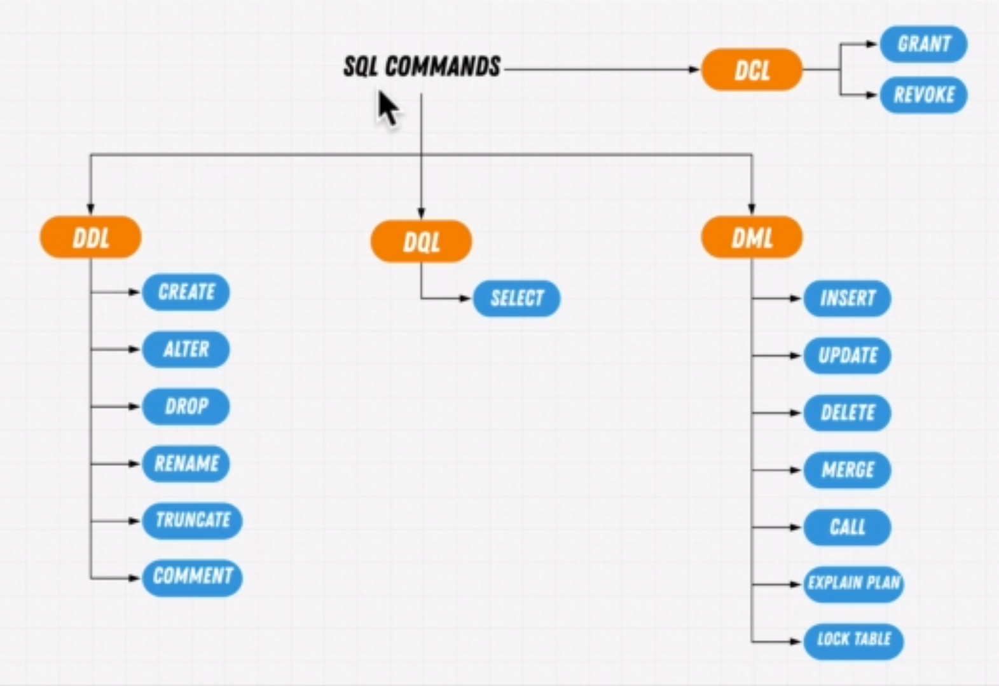
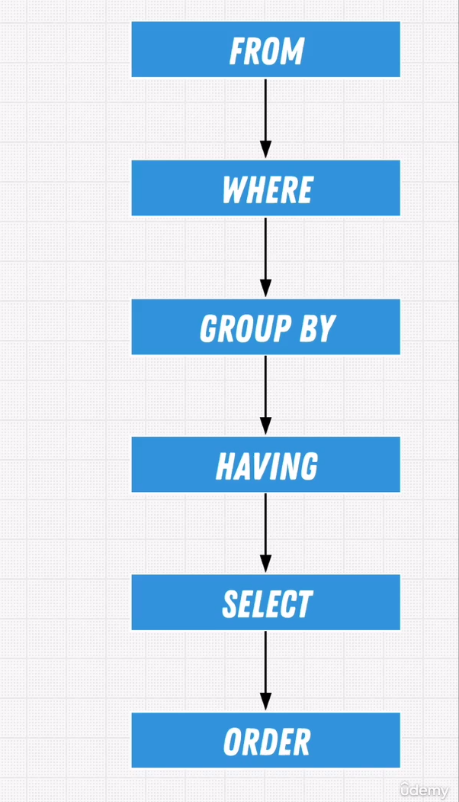

### Sql deep dive

### SQL commands

1. DCL: grant,revoke
2. DDL: create,alter,drop,rename,truncate,comment
3. DML: insert, update,delete,merge,call,explain plan,lock table
4. DQL: select

### SQL functions

1. Aggregate: sum, avg, count, min, max
2. Scalar: concat, etc.

### Postgres uses ISO-8601 (YYYY-MM-DDTHH:MM:SS)for date and time

Example: 2017-08-17T12:47:16+02:00

### Exercise

1. Select:

   SELECT \* from employees;

2. Column renaming:

   SELECT emp_no as "Employee #" from employees;

3. Column concatenation:

   SELECT CONCAT(emp_no,' is a ',title) as "Employee Title" from titles;

4. Avg:

   SELECT AVG(population) from city WHERE countrycode='NLD';

5. Not:

   SELECT COUNT(\*) FROM customers WHERE NOT age='55';

6. IS FALSE:

   SELECT age FROM customers WHERE age='55' is FALSE;

7. Coalesce:

   SELECT avg(coalesce(age,15)) from student;

8. Between:

   SELECT firstname,age from customers WHERE income<50000 and (age BETWEEN 30 and 50);

9. In:

   SELECT \* from employees where emp_no in (100001,100006,11008);

10. Like and ILike:

    SELECT COUNT(\*) FROM customers WHERE zip::TEXT LIKE '%2%'; // casting before comparison

    SELECT \* FROM employees WHERE first_name LIKE 'G%r';

    SELECT \* FROM employees WHERE first_name ILIKE 'G%ger';

11. Distinct:

    SELECT DISTINCT salary FROM salaries;

12. OrderBy:

    SELECT \* FROM customers ORDER BY name DESC;
    SELECT \* FROM customers ORDER BY LENGTH(first_name) DESC;

13. Cast

    CAST(salary as TEXT);
    salary::TEXT;

# Date operators

1. Current date:

   SELECT NOW()::DATE;
   SELECT CURRENT_DATE;

   SELECT TO_CHAR(CURRENT_DATE,'dd/mm/yyyy');

2. Date casting:

   SELECT DATE '12/12/12';

3. Age:

   SELECT AGE(DATE '1800/01/01');
   SELECT AGE(DATE '1992/01/01', DATE '1800/01/01');

4. Extraction:

   SELECT EXTRACT(DAY FROM DATE '1992/11/13');
   SELECT EXTRACT(MONTH FROM DATE '1992/11/13');
   SELECT EXTRACT(YEAR FROM DATE '1992/11/13');

5. Truncate:

   SELECT DATE_TRUNC('year', DATE '1992/11/13'); // truncation to year
   SELECT DATE_TRUNC('month', DATE '1992/11/13');  
   SELECT DATE_TRUNC('day', DATE '1992/11/13'); // no effect unless a timestamp

6. Intervals:

   SELECT \* FROM orders WHERE purchaseDate <= now() - interval '30 days'

   INTERVAL '1 year 2 months 3 days'
   INTERVAL '2 weeks ago'
   INTERVAL '1year 3 hours 20 minutes'

   SELECT EXTRACT(year FROM INTERVAL '1 year 2 months')

#### Exercises:

1. select \* from employees where EXTRACT(YEAR from age(birth_date)) > 60 // older than 60
   SELECT count(birth_date) FROM employees WHERE birth_date < now() - interval '61 years'

2. select count(\*) from employees where extract(month from hire_date) = 2 // hired in feb

3. select count(\*) from employees where EXTRACT(month from birth_date) = 11 // born in nov

4. SELECT COUNT(orderid)
   FROM orders
   WHERE DATE_TRUNC('month', orderdate) = date '2004-01-01';

5. SELECT MAX(AGE(birth_date)) FROM employees;

### Multi select

1. SELECT a.emp_no, CONCAT(a.first_name,a.last_name) as "name", b.salary FROM employees as a, salaries as b WHERE a.emp_no=b.emp_no;

### Inner Join

If you have a column that links the columns from table A to table B, you can use INNER JOIN

Note: The INNER JOIN keyword selects all rows from both tables as long as there is a match between the columns. If there are records in the "Orders" table that do not have matches in "Customers", these orders will not be shown!

### Self Join

This usually can be done when a table has a foreign key referencing its primary key.

1. SELECT a.id, a.name AS "emmployee", b.name AS "supervisor name";
   FROM employee AS a, INNER JOIN employee as b ON a.supervisorId = b.id;

### Outer Join

Refer: https://blog.codinghorror.com/a-visual-explanation-of-sql-joins/

Adds the data that don't have a match

2 types:

1. Left join: returns all records from the left table (table 1), and the matching records from the right table (table 2).
   The result is 0 records from the right side, if there is no match.

   SELECT \*
   FROM TABLE_A AS a
   Left \[OUTER] JOIN TABLE_B as b
   ON a.id=b.id

2. Right join: adds the data that don't have a match from table B. opposite of left join.

### Cross Join

Create a combination of every row

### Full outer join

Return results from both whether they match or not. (both sides null instead of left or right joins)

### Using

Instead of ON (if same primary and foreign key)

1. select e.emp_no, e.first_name, de.dept_no
   from employees as e
   inner join dept_emp as de USING(emp_no)

### Exercise

1. select a.emp_no, CONCAT(a.first_name,' ', a.last_name) as "Name", b.salary
   from employees as a
   inner join salaries as b on a.emp_no=b.emp_no
   order by a.emp_no asc

2. select a.emp_no, concat(a.first_name,' ',a.last_name), b.salary, c.title, c.from_date as "promoted on"
   from employees as a
   inner join salaries as b on a.emp_no=b.emp_no
   inner join titles as c on c.emp_no=a.emp_no
   and c.from_date=(b.from_date + interval '2 days')
   order by a.emp_no

3. select concat(customers.firstname,customers.lastname,' ') as "customer", orders.orderid
   from customers
   inner join orders on orders.orderid=customers.customerid
   where customers.state in ('OH','NY','OR')

4. select products.prod_id,inventory.quan_in_stock
   from products
   inner JOIN inventory
   on products.prod_id = inventory.prod_id

5. select concat(employees.first_name,employees.last_name,' ') as "employee" , departments.dept_name
   from employees
   inner join dept_emp on dept_emp.emp_no = employees.emp_no
   inner join departments on departments.dept_no = dept_emp.dept_no;

### Group by

Spilts data into groups or chunks so as to apply functions againt the group rather than the entire table.

1. select dept_no, count(\*)
   from dept_emp
   group by dept_no
